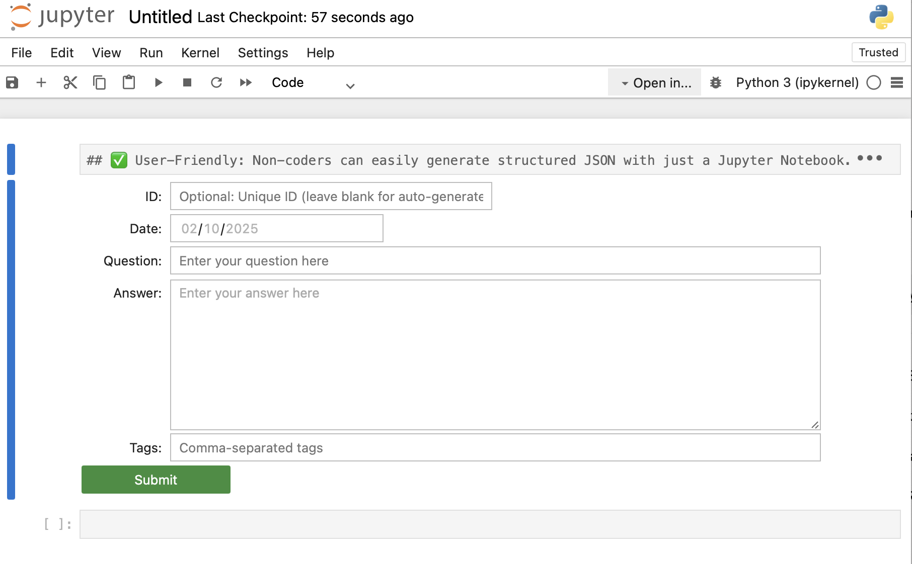

# Form for Generating JSON Q&A Tuples
This python code jupyter notebook file helps you create json snippets for question/answer tuples plus tags.

[text and code by ChatGPT 4o with human oversight by Johanna "Jonnie" Wilder, 10 February 2025]


# JSON Q&A Builder 📝  

🚀 **A simple, interactive Jupyter Notebook tool to generate structured JSON datasets for Fine-Tuning & RAG AI models.**  



## 📌 Why Use This?  
This tool helps **researchers, AI enthusiasts, and developers** create high-quality JSON datasets for training custom AI models.  
✅ **User-Friendly** – No coding required, just fill in fields & click Submit!  
✅ **Fine-Tune Ready** – Outputs structured JSON for **LLM fine-tuning & retrieval-augmented generation (RAG)**.  
✅ **Customizable** – Modify the fields or extend functionality as needed.  

---

## 🛠️ **Installation**  

### **1️⃣ Install Dependencies**  
Make sure you have **Python 3.11+** and Jupyter installed:  

```bash
pip install jupyter ipywidgets
